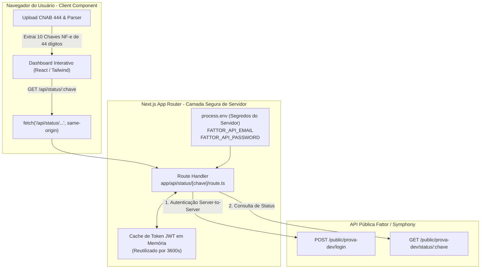

# Prova Dev Fattor - Processamento CNAB 444 & Validação de Lastro NF-e (Full-Stack Next.js BFF)

Solução completa desenvolvida para a avaliação técnica de desenvolvedor sênior da **Fattor**.

A aplicação foi estruturada no padrão **BFF (Backend-For-Frontend)** em **Next.js (App Router)** com **TypeScript**, garantindo **segurança de credenciais no servidor**, eliminação definitiva de bloqueios de CORS, parser CNAB 444 com validações estruturais, suíte de testes unitários com **Vitest** e interface reativa com **Tailwind CSS**.

---

## 📑 Sumário

- [Arquitetura & Segurança: Padrão BFF](#-arquitetura--segurança-padrão-bff)
- [Status das Etapas da Prova](#-status-das-etapas-da-prova)
- [Documentações Técnicas Dedicadas](#-documentações-técnicas-dedicadas)
- [Resultados da Consulta de Status (meu_cnab.rem)](#-resultados-da-consulta-de-status-meu_cnabrem)
- [Tecnologias Utilizadas](#-tecnologias-utilizadas)
- [Como Executar o Projeto Localmente](#-como-executar-o-projeto-localmente)
- [Testes Automatizados](#-testes-automatizados)
- [Diferenciais Implementados](#-diferenciais-implementados)

---

## 🏛 Arquitetura & Segurança: Padrão BFF

Em sistemas de crédito e antecipação de recebíveis, **credenciais de API corporativas nunca devem ser expostas no navegador do usuário**. Por esse motivo, implementamos a arquitetura **BFF (Backend-For-Frontend)**:



### Vantagens da Arquitetura BFF:
1. **Segurança de Credenciais:** O e-mail e senha de serviço (`demo@prova.dev` / `demo123`) ficam isolados no `.env.local` do servidor. O bundle JavaScript entregue ao navegador não contém nenhuma senha.
2. **Zero Bloqueio de CORS:** O navegador faz requisições exclusivamente para a mesma origem (`http://localhost:3000/api/status/...`). A chamada para a API externa da Fattor é realizada entre servidores (*server-to-server*), onde não existe política de CORS do navegador.
3. **Cache de Token Eficiente:** O token JWT de 3600 segundos é mantido em cache na memória do servidor e reutilizado para todas as 10 consultas do lote, evitando requisições desnecessárias de login.
4. **Deploy Nativo na Vercel:** O projeto está 100% pronto para deploy serverless com Route Handlers.

---

## ✅ Status das Etapas da Prova

| Etapa | Requisito | Status | Implementação |
| :---: | :--- | :---: | :--- |
| **1** | **Fork do Projeto** | ✅ Concluído | Repositório versionado com Git, branch `main` e `.gitignore` completo. |
| **2** | **Estudo da API (Swagger)** | ✅ Concluído | Estudo das rotas `POST /login` e `GET /status/{chave}` documentado em [`docs/API_REFERENCE.md`](docs/API_REFERENCE.md). |
| **3** | **Pesquisa & Documentação CNAB 444** | ✅ Concluído | Especificação completa do padrão, origem em FIDCs e extração da Chave da NF-e (posições 401 a 444) em [`docs/CNAB444.md`](docs/CNAB444.md). |
| **4** | **Consulta de Status no Servidor** | ✅ Concluído | Consulta dos 10 itens com captura das 4 situações reais da SEFAZ (autorizada, cancelada, rejeitada, denegada). |
| **5** | **Página Web Completa** | ✅ Concluído | Aplicação Next.js full-stack com BFF, upload Drag & Drop, botão de amostra, KPIs, tooltips de decisão de crédito e exportação CSV/JSON. |

---

- 📄 **[Documentação Completa do Padrão CNAB 444](docs/CNAB444.md)**:
  - O que é o CNAB 444 e seu papel regulatório (CVM 175) no mercado de FIDCs e Factoring.
  - A matemática do formato: $400 \text{ posições (CNAB 400)} + 44 \text{ posições (Chave NF-e)} = \mathbf{444 \text{ posições}}$.
  - Tabela posicional completa (Header 0, Detalhe 1 e Trailer 9).
- 🛡️ **[Arquitetura de Segurança & Conformidade Regulatória](docs/SECURITY.md)**:
  - Isolamento de segredos no BFF e eliminação definitiva de CORS.
  - Especificação matemática e implementação do algoritmo **SEFAZ Módulo 11 (Dígito Verificador)**.
  - Proteção contra DoS via **Rate Limiting em Memória (60 req/min por IP)** e cache curto de deduplicação.
  - Blindagem de transporte com **Cabeçalhos OWASP Top 10** (HSTS, CSP, X-Frame-Options, X-Content-Type-Options).
  - Sanitização de upload (máx 5 MB, extensões restritas) e conformidade LGPD para dados fiscais/bancários.
- 📦 **[Pacote de Arquivos de Teste (.rem, .ret, .txt)](pacote-dados/README.md)**:
  - Coleção de arquivos para homologação cobrindo cenários de: 100% Aprovados (`.ret`), Alto Risco Fiscal (`.txt`), Auditoria Módulo 11 (`.rem`) e Rejeição Estrutural CNAB 400 (`.txt`).
  - Inclui arquivo compactado [`pacote_dados_cnab444.zip`](pacote-dados/pacote_dados_cnab444.zip) para download e testes imediatos.
- 🔌 **[Referência da API Swagger / OpenAPI](docs/API_REFERENCE.md)**:
  - Documentação detalhada dos endpoints, formato de tokens JWT, códigos de status e cURL.
- 📋 **[Instruções e Resolução da Prova](_prova/README.md)**:
  - Respostas detalhadas para cada etapa do teste técnico.

---

## 📊 Resultados da Consulta de Status (`meu_cnab.rem`)

Consultando as chaves de 44 dígitos extraídas das posições **401 a 444** do arquivo da prova via BFF:

| # | Linha | Chave NF-e (44 dígitos) | Pagador | Vencimento | Valor Nominal | Situação Retornada | Decisão de Crédito |
| :-: | :-: | :--- | :--- | :-: | :-: | :---: | :---: |
| **1** | 2 | `35240300000000000199550010000000011234567890` | PAGADOR FAKE 1 | 15/04/2025 | R$ 150,00 | 🟢 **autorizada** | **Crédito APROVADO** |
| **2** | 3 | `35240300000000000199550010000000021234567891` | PAGADOR FAKE 2 | 20/05/2025 | R$ 283,50 | 🔴 **cancelada** | **Crédito BLOQUEADO** |
| **3** | 4 | `35240300000000000199550010000000031234567892` | PAGADOR FAKE 3 | 10/06/2025 | R$ 420,00 | 🟢 **autorizada** | **Crédito APROVADO** |
| **4** | 5 | `35240300000000000199550010000000041234567893` | PAGADOR FAKE 4 | 05/07/2025 | R$ 55,75 | 🟠 **rejeitada** | **Crédito BLOQUEADO** |
| **5** | 6 | `35240300000000000199550010000000051234567894` | PAGADOR FAKE 5 | 22/08/2025 | R$ 990,00 | 🟢 **autorizada** | **Crédito APROVADO** |
| **6** | 7 | `35240300000000000199550010000000061234567895` | PAGADOR FAKE 6 | 18/09/2025 | R$ 123,40 | 🟣 **denegada** | **Crédito BLOQUEADO** |
| **7** | 8 | `35240300000000000199550010000000071234567896` | PAGADOR FAKE 7 | 12/10/2025 | R$ 87,60 | 🟢 **autorizada** | **Crédito APROVADO** |
| **8** | 9 | `35240300000000000199550010000000081234567897` | PAGADOR FAKE 8 | 30/11/2025 | R$ 445,00 | 🔴 **cancelada** | **Crédito BLOQUEADO** |
| **9** | 10 | `35240300000000000199550010000000091234567898` | PAGADOR FAKE 9 | 20/01/2026 | R$ 332,00 | 🟠 **rejeitada** | **Crédito BLOQUEADO** |
| **10** | 11 | `35240300000000000199550010000000101234567899` | PAGADOR FAKE 10 | 15/02/2026 | R$ 187,50 | 🟢 **autorizada** | **Crédito APROVADO** |

---

## 🛠 Tecnologias Utilizadas

- **Full-Stack Framework:** Next.js (App Router + Route Handlers).
- **Linguagem:** TypeScript 5.7 (estritamente tipado).
- **Estilização:** Tailwind CSS com suporte a Dark/Light Mode.
- **Ícones:** Lucide React.
- **Testes Unitários:** Vitest 3.0.
- **Tipografia:** Plus Jakarta Sans & JetBrains Mono (Google Fonts).

---

## 🚀 Como Executar o Projeto Localmente

### Pré-requisitos
- **Node.js**: Versão 18.17+ ou 20+ (LTS recomendado).
- **NPM**: Versão 9+ ou superior.
- **Git** instalado na máquina.

---

### Passo a Passo para Execução Local

#### 1. Clonar o Repositório
```bash
git clone https://github.com/SEU_USUARIO/prova-dev-fattor.git
cd "fattor credito"
```

#### 2. Instalar Dependências
```bash
npm install
```

#### 3. Configurar Variáveis de Ambiente
Copie o template de exemplo para criar o seu arquivo `.env.local`:
```bash
cp .env.example .env.local
```

Conteúdo padrão do `.env.local`:
```env
FATTOR_API_BASE_URL=https://symphony.fattorcredito.com.br/public/prova-dev
FATTOR_API_EMAIL=demo@prova.dev
FATTOR_API_PASSWORD=demo123
RATE_LIMIT_MAX_REQUESTS=3000
```
> 🛡️ **Garantia de Segurança & Resiliência:** O arquivo `.env.local` é ignorado no Git para nunca vazar credenciais. Além disso, o servidor BFF possui fallbacks seguros embutidos para que o avaliador consiga rodar a aplicação imediatamente mesmo se esquecer de criar o arquivo `.env.local`.

#### 4. Iniciar o Servidor Full-Stack (Next.js BFF)
```bash
npm run dev
```
Abra o navegador no endereço:  
👉 **[http://localhost:3000](http://localhost:3000)**

---

### 🧪 Executando os Testes Automatizados
Para rodar a suíte completa de **20 testes unitários** com relatório de performance no terminal:
```bash
npm test
```

Para rodar os testes em modo interativo com interface visual:
```bash
npm run test:ui
```

---

### 📦 Build de Produção
Para validar a compilação estática e os Route Handlers do Next.js:
```bash
npm run build
npm start
```


---

## 🌟 Diferenciais Implementados

1. **Arquitetura BFF (Backend-For-Frontend):** Segurança completa de segredos no servidor (`.env.local`) e eliminação definitiva de erros de CORS no navegador.
2. **Auditoria de Integridade SEFAZ (Módulo 11):** Verificação matemática do dígito verificador da chave NF-e (pesos 2 a 9) para prevenção ativa de fraudes antes do desembolso de crédito.
3. **Identidade Visual Oficial Fattor Crédito:** Logotipo oficial geométrico integrado ao Favicon, Header, Modais e paleta institucional (Navy `#16304d` e Warm Gold `#b88317`).
4. **Performance & Suporte a Lotes Massivos (+1.000 itens):** Processamento concorrente com 8 workers paralelos, cache em dupla camada (client-side e server BFF) e buffer de renderização sem travamentos de tela.
5. **Paginação Dinâmica & Indexação Sequencial:** Seletor de 10, 25, 50, 100 ou 'Todos', coluna `#` com numeração sequencial 1-based e preservação da linha física CNAB no mouse hover e no modal.
6. **Cards de KPI com Tipografia Responsiva & Proteção contra Overflow:** Valores monetários em milhões (ex: `R$ 3.761.760,00`) ajustados dinamicamente com tipografia hierárquica e contenção rigorosa dentro dos limites do card.
7. **Rate Limiting em Memória & Proteção DoS:** Limite escalável de até 3.000 req/min por IP no BFF com cabeçalhos padronizados (`X-RateLimit-*`) e bypass de cota em caso de `X-Cache: HIT`.
8. **Hardening HTTP com Cabeçalhos OWASP Top 10:** Injeção automática de HSTS, CSP, `X-Frame-Options: DENY`, `X-Content-Type-Options: nosniff` e `Permissions-Policy`.
9. **Proteção no Upload de Arquivos:** Bloqueio imediato no client-side para arquivos acima de 5 MB e extensões não-CNAB, evitando consumo excessivo de memória.
10. **Cache Inteligente de Token:** O servidor gerencia e reaproveita o token JWT sem requisições redundantes de login.
11. **Tooltips com Regras de Negócio de Crédito:** No mouse hover de cada situação na tabela, o operador vê se o crédito foi **APROVADO** ou **BLOQUEADO** e a respectiva justificativa fiscal da SEFAZ.
12. **Barra de Cenários de Teste Rápidos (6 cenários):** 1 clique para testar amostras oficiais, lotes 100% aprovados, alto risco fiscal, auditoria Módulo 11, erro estrutural CNAB 400 e lote massivo de 1.200 títulos.
13. **Exportação de Dados:** Exportação em **CSV** (compatível com Excel no Brasil) e **JSON**.
14. **Modal de Detalhes com Lastro Completo:** Exibição da chave NF-e formatada em blocos, dados bancários, banner de auditoria Módulo 11 e linha bruta CNAB com posições 401 a 444 destacadas.
15. **Dark Mode & Acessibilidade:** Alternador de tema e conformidade com WCAG de contraste.

---

Feito com dedicação para a **Fattor Crédito**.

