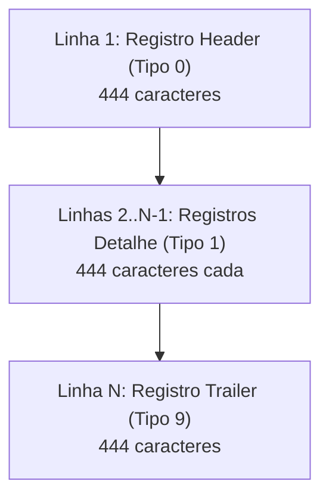

# Documentação Técnica: Formato CNAB 444

## 1. O que é o Formato CNAB 444?

O **CNAB 444** (Centro Nacional de Automação Bancária - 444 posições) é uma extensão especializada do padrão tradicional **CNAB 400**, concebida primordialmente pelo mercado financeiro brasileiro para atender operações de **Cessão de Crédito**, **Factoring**, **Securitizadoras** e **FIDCs** (Fundos de Investimento em Direitos Creditórios).

Enquanto o padrão FEBRABAN CNAB 400 tradicional foi desenhado para a cobrança bancária simples entre cedente e banco, as operações de crédito estruturado necessitam obrigatoriamente da comprovação do **lastro fiscal** dos títulos cedidos (duplicatas mercantis e de prestação de serviços).

---

## 2. Por que 444 Posições? A Relação com a NF-e

Com o advento do **Sistema Público de Escrituração Digital (SPED)** e a instituição da **Nota Fiscal Eletrônica (NF-e)** no Brasil, cada documento fiscal emitido passou a possuir uma **Chave de Acesso** única de **44 caracteres numéricos**, composta por:

$$\text{Chave NF-e (44 dígitos)} = \text{cUF (2)} + \text{AAMM (4)} + \text{CNPJ Emitente (14)} + \text{mod (2)} + \text{série (3)} + \text{nNF (9)} + \text{tpEmis (1)} + \text{cNF (8)} + \text{cDV (1)}$$

### O Problema do CNAB 400
No layout original do CNAB 400, todas as 400 posições de cada linha já estavam comprometidas com dados bancários legados (carteira, agência, conta, nosso número, vencimento, valor, sacado, etc.). Não havia espaço contíguo livre suficiente para alocar os 44 dígitos da NF-e sem quebrar sistemas de processamento legados.

### A Solução do Mercado: CNAB 444
As instituições financeiras (como Itaú, Bradesco e custodiantes de FIDCs) optaram por **adicionar 44 posições ao final de cada linha** de 400 bytes:

$$400 \text{ posições (CNAB 400 padrão)} + 44 \text{ posições (Chave NF-e)} = \mathbf{444 \text{ posições}}$$

Dessa forma:
- Todas as linhas do arquivo (Header, Detalhe e Trailer) passam a ter rigorosamente **444 caracteres** (mais a quebra de linha `\r\n` ou `\n`).
- No registro de detalhe (tipo `1`), as posições **401 a 444** passam a conter a **Chave de Acesso da NF-e**, permitindo a verificação automatizada de lastro fiscal junto aos webservices da SEFAZ.

---

## 3. Uso no Mercado e Importância Regulatória

No ecossistema de crédito e antecipação de recebíveis:
1. **Validação de Lastro**: Fundos de Investimento (FIDCs) são regulamentados pela CVM (Resolução CVM 175) e exigem custódia qualificada. O custodiante precisa verificar se a duplicata mercantil negociada tem respaldo em uma NF-e válida, autorizada e sem cancelamento na SEFAZ.
2. **Prevenção a Fraudes**: A existência da chave de acesso no arquivo impede a negociação de "duplicatas frias" (duplicatas simuladas sem circulação real de mercadoria ou serviço).
3. **Automação de Baixas e Liquidação**: Ao integrar o arquivo de retorno, a liquidação financeira no banco é automaticamente correlacionada à nota fiscal correspondente.

---

## 4. Comparativo: CNAB 240 vs CNAB 400 vs CNAB 444

| Característica | CNAB 240 | CNAB 400 | CNAB 444 |
| :--- | :--- | :--- | :--- |
| **Tamanho da Linha** | 240 caracteres | 400 caracteres | **444 caracteres** |
| **Hierarquia** | Arquivo $\rightarrow$ Lote $\rightarrow$ Detalhe | Arquivo $\rightarrow$ Detalhe | Arquivo $\rightarrow$ Detalhe |
| **Foco Principal** | Cobrança, Pagamentos a Fornecedores, Salários | Cobrança bancária simples | **Cobrança + Antecipação de Recebíveis / FIDC** |
| **Suporte Nativo à NF-e** | Segmento Y-50 (múltiplas linhas) | Não possui (incompatível) | **Posições 401 a 444 em cada linha de detalhe** |
| **Complexidade de Parse** | Média/Alta (múltiplos tipos de segmentos A, B, J, etc.) | Baixa | **Baixa/Média (direto e objetivo)** |

---

## 5. Estrutura Detalhada do Arquivo CNAB 444

O arquivo é composto por 3 tipos de registros textuais de tamanho fixo:



### 5.1. Registro Header de Arquivo (Tipo 0)

Identifica a remessa, a instituição financeira e a empresa cedente.

| Posição Início | Posição Fim | Tamanho | Formato | Descrição | Exemplo no Arquivo da Prova |
| :---: | :---: | :---: | :---: | :--- | :--- |
| **001** | **001** | 1 | Numérico | Tipo de Registro (`0` = Header) | `0` |
| **002** | **004** | 3 | Numérico | Código do Banco na Compensação | `341` (Banco Itaú) |
| **005** | **019** | 15 | Alfanumérico | Literal de Identificação da Remessa | `REMESSA        ` |
| **020** | **021** | 2 | Numérico | Código do Serviço (`01` = Cobrança) | `01` |
| **022** | **036** | 15 | Alfanumérico | Literal de Serviço | `COBRANCA       ` |
| **047** | **076** | 30 | Alfanumérico | Razão Social da Empresa Cedente | `PROVA DEV CNAB 444 AMOSTRA    ` |
| **077** | **079** | 3 | Numérico | Número do Banco | `001` |
| **095** | **120** | 26 | Alfanumérico | Nome / Identificação do Arquivo | `PROVA TECNICA             ` |
| **121** | **126** | 6 | Numérico | Data de Gravação do Arquivo (`DDMMAA`) | `120326` (12/03/2026) |
| **133** | **139** | 7 | Numérico | Sequencial da Remessa | `0000001` |
| **140** | **444** | 305 | Alfanumérico | Complemento do Registro (Brancos) | Espaços em branco |

---

### 5.2. Registro Detalhe / Título (Tipo 1)

Representa cada título de crédito (duplicata mercantil) a ser cobrado ou antecipado.

| Posição Início | Posição Fim | Tamanho | Formato | Descrição | Exemplo no Item 1 |
| :---: | :---: | :---: | :---: | :--- | :--- |
| **001** | **001** | 1 | Numérico | Tipo de Registro (`1` = Detalhe) | `1` |
| **002** | **021** | 20 | Alfanumérico | Identificação da Empresa Cedente / Agência / Conta | `0000001000010000000 ` |
| **022** | **032** | 11 | Numérico | Nosso Número (identificador do título no banco) | `10000000001` |
| **033** | **033** | 1 | Alfanumérico | Carteira / Código da Carteira | `P` |
| **034** | **058** | 25 | Alfanumérico | Número de Controle do Participante (Seu Número) | `CONTROLE1                ` |
| **059** | **068** | 10 | Numérico | Número do Documento | `0000000005` |
| **072** | **095** | 24 | Alfanumérico | Espécie do Título | `DUPLICATA MERCANTIL      ` |
| **096** | **101** | 6 | Numérico | Data de Vencimento do Título (`DDMMAA`) | `150425` (15/04/2025) |
| **102** | **114** | 13 | Numérico | Valor Nominal do Título (em centavos, 2 decimais) | `0000000015000` (R$ 150,00) |
| **115** | **117** | 3 | Numérico | Código da Moeda / Espécie | `009` |
| **122** | **122** | 1 | Alfanumérico | Aceite (`A` = Aceito, `N` = Não Aceito) | `N` |
| **137** | **150** | 14 | Numérico | CPF / CNPJ do Pagador / Sacado | `00000000000000` |
| **151** | **180** | 30 | Alfanumérico | Nome do Pagador / Sacado | `PAGADOR FAKE 1                ` |
| **248** | **262** | 15 | Alfanumérico | Município / Cidade do Sacado | `SAO PAULO      ` |
| **269** | **276** | 8 | Numérico | CEP do Sacado | `01310100` (01310-100) |
| **285** | **286** | 2 | Alfanumérico | Estado / UF do Sacado | `SP` |
| **287** | **400** | 114 | Alfanumérico | Informações complementares / Sacador Avalista / Brancos | Espaços em branco |
| **401** | **444** | **44** | **Numérico** | **Chave de Acesso da NF-e (Lastro Fiscal)** | **`35240300000000000199550010000000011234567890`** |

> [!IMPORTANT]
> **Identificador Extraído para Consulta de Status na API:**  
> A fatia correspondente ao índice base 0 em linguagens como JavaScript/TypeScript ou Python é:
> ```typescript
> const chaveNFe = linha.substring(400, 444).trim();
> ```
> Trata-se exatamente da **Chave de Acesso da NF-e** (posições 401 a 444 do layout posicional 1-indexed).

---

### 5.3. Registro Trailer de Arquivo (Tipo 9)

Encerra o arquivo e sumariza os registros processados.

| Posição Início | Posição Fim | Tamanho | Formato | Descrição | Exemplo no Arquivo da Prova |
| :---: | :---: | :---: | :---: | :--- | :--- |
| **001** | **001** | 1 | Numérico | Tipo de Registro (`9` = Trailer) | `9` |
| **002** | **391** | 390 | Alfanumérico | Brancos | Espaços em branco |
| **392** | **397** | 6 | Numérico | Quantidade Total de Linhas do Arquivo | `000012` (12 linhas no total) |
| **398** | **444** | 47 | Alfanumérico | Brancos | Espaços em branco |

---

## 6. Mapeamento dos Itens do Arquivo `meu_cnab.rem`

Abaixo, a decomposição dos 10 registros de títulos extraídos do arquivo da prova:

| Linha | Seu Número | Nosso Número | Vencimento | Valor Nominal | Pagador | Chave de Acesso NF-e (Pos 401-444) |
| :---: | :--- | :--- | :---: | :---: | :--- | :--- |
| **2** | CONTROLE1 | 10000000001 | 15/04/2025 | R$ 150,00 | PAGADOR FAKE 1 | `35240300000000000199550010000000011234567890` |
| **3** | CONTROLE2 | 10000000002 | 20/05/2025 | R$ 283,50 | PAGADOR FAKE 2 | `35240300000000000199550010000000021234567891` |
| **4** | CONTROLE3 | 10000000003 | 10/06/2025 | R$ 420,00 | PAGADOR FAKE 3 | `35240300000000000199550010000000031234567892` |
| **5** | CONTROLE4 | 10000000004 | 05/07/2025 | R$ 55,75 | PAGADOR FAKE 4 | `35240300000000000199550010000000041234567893` |
| **6** | CONTROLE5 | 10000000005 | 22/08/2025 | R$ 990,00 | PAGADOR FAKE 5 | `35240300000000000199550010000000051234567894` |
| **7** | CONTROLE6 | 10000000006 | 18/09/2025 | R$ 123,40 | PAGADOR FAKE 6 | `35240300000000000199550010000000061234567895` |
| **8** | CONTROLE7 | 10000000007 | 12/10/2025 | R$ 87,60 | PAGADOR FAKE 7 | `35240300000000000199550010000000071234567896` |
| **9** | CONTROLE8 | 10000000008 | 30/11/2025 | R$ 445,00 | PAGADOR FAKE 8 | `35240300000000000199550010000000081234567897` |
| **10** | CONTROLE9 | 10000000009 | 20/01/2026 | R$ 332,00 | PAGADOR FAKE 9 | `35240300000000000199550010000000091234567898` |
| **11** | CONTROLE10 | 10000000010 | 15/02/2026 | R$ 187,50 | PAGADOR FAKE 10 | `35240300000000000199550010000000101234567899` |
