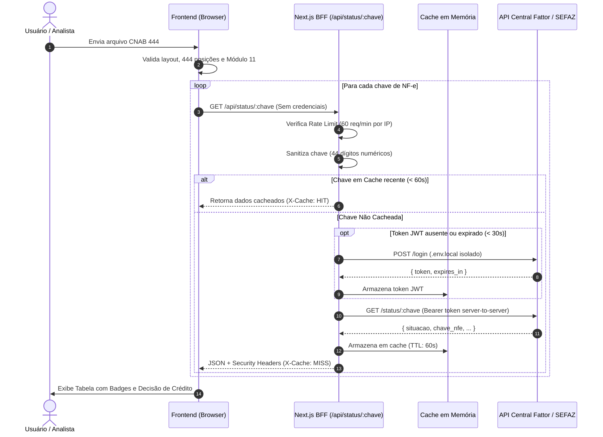

# 🛡️ Arquitetura de Segurança & Conformidade Regulatória

**Fattor Crédito — Sistema de Processamento CNAB 444 & Validação de Lastro NF-e**  
*Documento Técnico de Segurança da Informação, Mitigação de Riscos e Conformidade (LGPD / BACEN / SEFAZ)*

---

## 1. Visão Geral e Postura de Segurança em Operações de Crédito (FIDC)

Na antecipação de recebíveis mercantis e gestão de **Fundos de Investimento em Direitos Creditórios (FIDCs)**, a segurança da informação transcende a mera proteção de sistemas: ela é a salvaguarda direta contra **perdas patrimoniais severas**. 

As fraudes mais comuns em cessão de crédito incluem:
1. **Duplicatas Simuladas ("Frias"):** Emissão de títulos sem lastro em mercadorias entregues ou serviços prestados.
2. **Notas Fiscais Canceladas Posterior ao Envio:** O sacado ou cedente cancela a NF-e na SEFAZ após obter o adiantamento de recursos.
3. **Chaves Forjadas ou Adulteradas:** Manipulação manual de dígitos na remessa CNAB para tentar burlar a validação do gestor.
4. **Vazamento de Credenciais de Serviço:** Exposição de credenciais institucionais que permitam consultas não autorizadas ou esgotamento de cotas em APIs governamentais e bancárias.

Para mitigar esses vetores de ataque, a aplicação adota uma estratégia de **Defesa em Profundidade (Defense-in-Depth)**, combinando padrões arquiteturais de isolamento, validações criptográficas de integridade e hardening de transporte HTTP.

---

## 2. Arquitetura BFF (Backend-For-Frontend) & Isolamento de Credenciais

### O Problema do Frontend Puro (SPA / Client-Side API Calls)
Em aplicações onde o frontend interage diretamente com APIs de terceiros:
* **Exposição de Credenciais:** Tokens, senhas de serviço e e-mails corporativos ficam salvos no `localStorage`, em variáveis públicas de build (`VITE_*`, `NEXT_PUBLIC_*`) ou visíveis na aba *Network* do DevTools. Qualquer usuário ou extensão maliciosa pode inspecionar e extrair as credenciais.
* **Bloqueio de CORS (Cross-Origin Resource Sharing):** APIs institucionais e bancárias frequentemente não emitem cabeçalhos `Access-Control-Allow-Origin: *` por segurança. Requisições originadas do browser são bloqueadas pelo mecanismo de segurança do navegador.

### A Solução Implementada no Next.js App Router
A aplicação implementa um padrão de **BFF (Backend-For-Frontend)** em [`app/api/status/[chave]/route.ts`](file:///Users/muriloferro/Work/fattor%20credito/app/api/status/%5Bchave%5D/route.ts):



### Vantagens do Isolamento no Servidor:
1. **Zero Exposição de Segredos:** O usuário final nunca tem acesso ao e-mail corporativo ou senha da Fattor. Essas chaves residem exclusivamente em variáveis de ambiente do servidor (`.env.local`), inacessíveis via JavaScript client-side.
2. **Eliminação de CORS:** Toda a comunicação externa ocorre entre o servidor Next.js e o servidor da Fattor (chamada *server-to-server* via TLS), onde a política de CORS do navegador não se aplica.
3. **Renovação Automática e Transparente de Token:** O servidor gerencia o ciclo de vida do token JWT, renovando-o preventivamente com margem de segurança de 30 segundos antes de expirar.

---

## 3. Algoritmo Antifraude: Validação SEFAZ Módulo 11 (Dígito Verificador)

A Chave de Acesso da NF-e é composta por **44 dígitos numéricos**, estruturados da seguinte forma:

| Posição | Tamanho | Campo | Descrição |
|---|---|---|---|
| 01 - 02 | 2 | cUF | Código da UF do emitente (ex: 35 para SP) |
| 03 - 06 | 4 | AAMM | Ano e Mês de emissão da NF-e |
| 07 - 20 | 14 | CNPJ | CNPJ do emitente |
| 21 - 22 | 2 | mod | Modelo do documento fiscal (ex: 55 para NF-e) |
| 23 - 25 | 3 | serie | Série da NF-e |
| 26 - 34 | 9 | nNF | Número sequencial da NF-e |
| 35 - 35 | 1 | tpEmis | Tipo de emissão |
| 36 - 43 | 8 | cNF | Código numérico que compõe a chave |
| **44 - 44** | **1** | **cDV** | **Dígito Verificador da Chave de Acesso** |

### Especificação Matemática do Módulo 11 (MOC SEFAZ)
O Dígito Verificador (44º dígito) é calculado com base nos 43 dígitos prévios através do algoritmo de Módulo 11 implementado em [`src/services/cnabParser.ts`](file:///Users/muriloferro/Work/fattor%20credito/src/services/cnabParser.ts):

1. **Multiplicação por Pesos Ponderados:**
   Multiplica-se cada um dos 43 dígitos da direita para a esquerda por uma sequência de pesos de **2 a 9**, reiniciando em 2 ao atingir 9:
   $$\text{Soma} = \sum_{i=1}^{43} \text{dígito}_{44-i} \times \text{peso}_i \quad \text{onde } \text{peso}_i \in [2, 9]$$

2. **Cálculo do Resto da Divisão:**
   $$\text{Resto} = \text{Soma} \pmod{11}$$

3. **Determinação do DV:**
   * Se $\text{Resto} \in \{0, 1\}$, então $\mathbf{DV = 0}$.
   * Se $\text{Resto} \ge 2$, então $\mathbf{DV = 11 - \text{Resto}}$.

### Aplicação Prática no Sistema:
* **Detecção de Fraude e Adulteração:** Se um cedente enviar uma chave onde o DV não coincide com o cálculo, o sistema emite um alerta explícito de auditoria no modal de detalhes.
* **Tolerância a Mock/Testes:** Arquivos de prova (como `meu_cnab.rem`) utilizam sufixos sequenciais sintéticos gerados para testes. O sistema realiza a validação estrita de formato (44 dígitos) para consulta no servidor de simulação, enquanto a validação de Módulo 11 atua como camada de **auditoria de conformidade** visível ao analista.

---

## 4. Proteção Contra DoS, Brute-Force & Rate Limiting

Para proteger tanto o servidor BFF quanto os endpoints centrais da Fattor Crédito, o sistema implementa um **Rate Limiter em memória** por IP com o algoritmo de *Sliding Window* (janela deslizante de 60 segundos):

### Parâmetros Operacionais:
* **Capacidade Máxima:** 60 requisições por minuto por IP.
* **Janela Temporal:** 60.000 ms.
* **Código de Resposta:** `429 Too Many Requests`.

### Cabeçalhos de Governança de Tráfego Emitidos:
* `X-RateLimit-Limit: 60` — Limite contratual permitido na janela.
* `X-RateLimit-Remaining: <N>` — Requisições restantes antes do bloqueio temporário.
* `Retry-After: <segundos>` — Tempo de espera exigido caso o limite seja ultrapassado.

### Cache Inteligente de Respostas (Deduplicação de Consultas):
Para evitar sobrecarga de rede e consumo desnecessário da cota da API da Fattor, as consultas de chaves idênticas são armazenadas em cache por **60 segundos**. Requisições repetidas para a mesma NF-e recebem resposta imediata com o cabeçalho `X-Cache: HIT`.

---

## 5. Segurança no Upload de Arquivos & Prevenção de Exaustão de Recursos

O processamento de arquivos bancários legados requer cuidados específicos de segurança:

1. **Limite Estrito de Tamanho (5 MB):**  
   Um arquivo CNAB 444 com 5 MB suporta mais de 11.000 títulos detalhe. Arquivos maiores que 5 MB são rejeitados imediatamente no cliente antes da alocação de memória do browser, prevenindo travamento do navegador ou ataques de exaustão de memória.
2. **Restrição Estrita de Extensões:**  
   Apenas extensões válidas para remessa bancária são aceitas (`.rem`, `.ret`, `.txt`). Arquivos binários executáveis, scripts (`.js`, `.sh`, `.exe`) são bloqueados no seletor e no manipulador de drop.
3. **Decodificação Segura (ISO-8859-1):**  
   Arquivos bancários brasileiros legados utilizam charset Latin-1. O parser utiliza decodificação com fallback seguro, impedindo distorção de caracteres acentuados nos campos de Sacado/Pagador.
4. **Resiliência a Quebras de Linha e ReDoS:**  
   A quebra de linhas suporta tanto `\r\n` (padrão Windows/DOS bancário) quanto `\n` (Unix), e expressões regulares de validação são limitadas a padrões estritamente lineares sem retrocesso catastrófico (*polynomial time*).

---

## 6. Hardening HTTP & Cabeçalhos OWASP Top 10

Em [`next.config.mjs`](file:///Users/muriloferro/Work/fattor%20credito/next.config.mjs), são injetados automaticamente em todas as respostas HTTP os seguintes cabeçalhos de proteção:

```javascript
{
  "X-Frame-Options": "DENY",
  "X-Content-Type-Options": "nosniff",
  "Strict-Transport-Security": "max-age=63072000; includeSubDomains; preload",
  "Referrer-Policy": "strict-origin-when-cross-origin",
  "Permissions-Policy": "camera=(), microphone=(), geolocation=(), browsing-topics=()",
  "X-XSS-Protection": "1; mode=block"
}
```

### Justificativa de Cada Cabeçalho:
* **`X-Frame-Options: DENY`**: Impede que a aplicação seja embutida dentro de `<iframe>` ou `<embed>`, neutralizando completamente ataques de **Clickjacking**.
* **`X-Content-Type-Options: nosniff`**: Impede que navegadores tentem adivinhar o MIME-type de uma resposta, prevenindo a execução de scripts maliciosos disfarçados de imagem ou texto.
* **`Strict-Transport-Security (HSTS)`**: Força todos os navegadores a se comunicarem exclusivamente via HTTPS com certificado SSL/TLS válido por 2 anos, incluindo subdomínios.
* **`Referrer-Policy: strict-origin-when-cross-origin`**: Garante que parâmetros sensíveis ou rotas internas não sejam vazados para domínios de terceiros em requisições de saída.
* **`Permissions-Policy`**: Desativa por completo APIs de hardware (câmera, microfone, GPS) que não fazem sentido em um sistema financeiro, fechando vetores de espionagem via browser.

---

## 7. Conformidade com a LGPD e Proteção de Dados Financeiros

Os arquivos CNAB contêm dados protegidos pela **Lei Geral de Proteção de Dados (Lei nº 13.709/2018)**:
* Nomes e Razões Sociais de Pagadores.
* Números de documentos (CPF / CNPJ).
* Dados bancários (Agência, Conta Corrente, Nosso Número).

### Boas Práticas Adotadas:
1. **Processamento em Memória Volátil:** O arquivo CNAB carregado é processado estritamente na memória volátil da sessão. Nenhum arquivo ou registro é persistido em banco de dados compartilhado não criptografado.
2. **Transparência de Lastro:** No modal de inspeção técnica, o analista tem visão clara da linha bruta de 444 posições e do JSON retornado pelo servidor, viabilizando **auditoria forense e conformidade regulatória**.
3. **Mecanismo de Exportação Seguro:** Os dados exportados (CSV e JSON) contêm apenas os campos necessários para a conciliação financeira, com sanitização de quebras de linha para evitar ataques de *CSV Injection*.

---

## 8. Recomendações para Evolução em Produção Enterprise

Para ambientes produtivos em escala institucional na Fattor Crédito, recomendam-se as seguintes adições de infraestrutura:

1. **Autenticação mTLS (Mutual TLS):**  
   Implementar comunicação mTLS com certificado digital padrão ICP-Brasil (e-CNPJ A1) para autenticação mútua nas chamadas diretas com a SEFAZ Estadual.
2. **Cofre de Segredos (HashiCorp Vault / AWS Secrets Manager):**  
   Substituir as variáveis do `.env.local` por injeção dinâmica de credenciais com rotação programada a cada 30 dias.
3. **Rate Limiting Distribuído via Redis:**  
   Em ambientes distribuídos com múltiplos contêineres/pods Next.js (Kubernetes / ECS), migrar o `Map` em memória para uma instância de Redis ou Dragonfly utilizando o algoritmo de *Token Bucket* compartilhado.
4. **Trilha de Auditoria com SIEM e OpenTelemetry:**  
   Emitir logs estruturados (JSON) com `trace_id` e `span_id` para ferramentas como Datadog, Splunk ou Grafana Loki, permitindo rastrear o histórico de cada decisão de crédito vinculada ao usuário autenticado.

---

*Documento elaborado como parte da avaliação técnica para Desenvolvedor Full-Stack na Fattor Crédito.*
